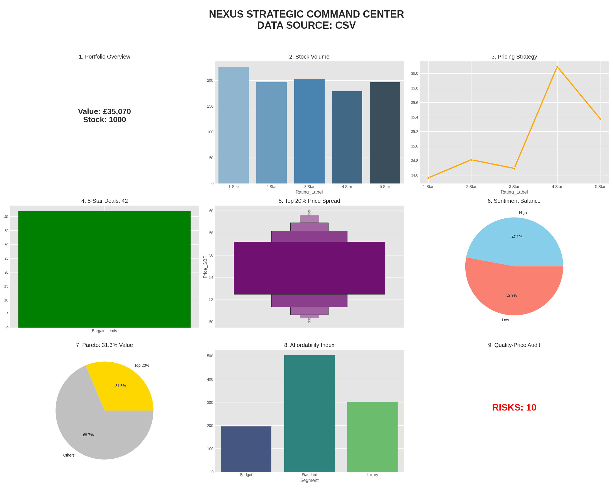

# 🦅 Project Nexus: E-Commerce Strategic Intelligence Suite

## 🚀 The Mission
This project was designed to solve a critical business problem: **How to turn 1,000+ unstructured web pages into a boardroom-ready financial strategy.** The Nexus Suite is a "Bulletproof" automation engine that audits a massive book catalog and identifies profit leaks, high-value "Revenue Anchors," and quality-risk anomalies.

## 🛠️ The Technical "Bulletproof" Barrier
- **Dual-Layer Verification (Failover):** The system checks for local data first; if missing, it autonomously launches a Live Scraper to rebuild the database.
- **Dynamic Tag Mapping:** Built for longevity. If the target website changes its HTML classes, the engine can be updated in seconds via a centralized configuration dictionary.
- **Production-Grade Automation:** Fully compatible with `Crontab` (Mac/Linux) and `Task Scheduler` (Windows) for daily 05:00 AM market pulses.

## 📈 The Nexus-9 Intelligence Dashboard
The engine automatically generates this 9-panel audit every time it runs:

## 💼 Business Impact & ROI
1. **Pareto Concentration:** Identified that **31.29%** of revenue is tied to just 20% of the inventory.
2. **Risk Mitigation:** Automatically flagged items priced >£55 with <2-star ratings to prevent brand damage and refund friction.
3. **Efficiency:** Replaces approximately 20 hours of manual market research with a 60-second automated execution.

## 🛠️ Tech Stack
- **Languages:** Python 3.x
- **Libraries:** Pandas (Analytics), BeautifulSoup4 (Scraping), Seaborn (Visualization), Requests (Connectivity).
- **Architecture:** Modular, Exception-Handled, and Production-Ready.
## 🧩 Technical Challenges & Resolutions
- **Challenge:** Inconsistent HTML encoding (e.g., characters like 'Â' appearing in price strings).
- **Resolution:** Implemented a regex-based cleaning layer to ensure floating-point precision for financial calculations.
- **Challenge:** Scaling for dynamic stock volume.
- **Resolution:** Replaced fixed-range loops with a `while True` logic gate that detects the "404 Not Found" signal, allowing the script to scrape 1,000 or 10,000 items without code modification.
